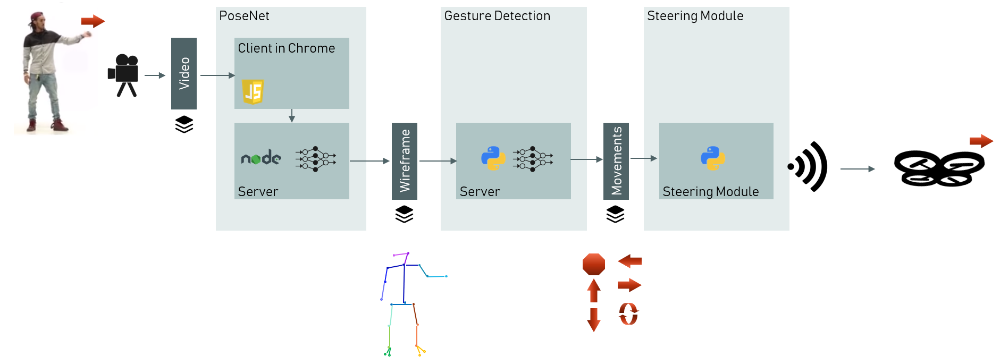
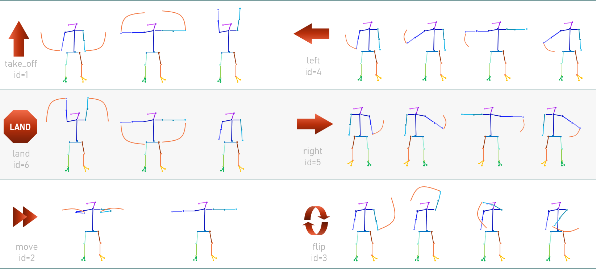
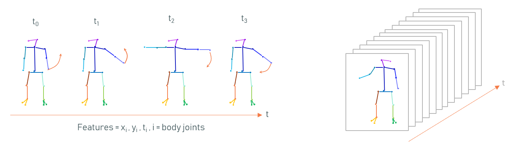

## Drone Steering Using Gestures

This project enables the user to steer a drone with gestures recorded live by a webcam. We accomplished this by training a Long Short-Term Memory neural network on top of Google’s PoseNet model. The project comprises not only the trained model, but also a working and fully integrated system from webcam to drone.

We will first introduce the system and the supported gestures - you find the installation instructions and an explanation of the folder structure at the bottom.

### System Overview

This project is as much an engineering problem as it is a machine learning problem. We built and connected three modules to achieve our goal:



* The PoseNet model extracts so-called wireframes, i.e. x/y coordinates of human body parts like elbow or wrist from a video stream. We run PoseNet on a local node.js server. The user plays the video stream using the browser which connects to the server. The server then broadcasts a stream of wireframes via web socket.
* The Gesture Detection module is a web socket server running in Python. It receives the broadcasted wireframes from PoseNet. Upon receiving, the server feeds the wireframe into a gesture detection model. This model translates the wireframes and patterns within these into commands that can be understood by the drone (e.g. ‘take-off’ or ‘left’).
* The Steering Module picks up the movement stream and translates it into the commands required by the drone’s API. It uses multi-threading to cope with long execution times while the drone is finishing a command.

### Gestures

The model currently supports six gestures: take-off, land, move, left, right and flip. The chart below shows the gesture definitions. For example, the take-off gesture is performed by raising both your hands from a start position beside the hips in a circular movement to an end position above your head.



Technically speaking, a gesture is a sequence of wireframes as shown in the figure below. We assumed an average framerate of 120ms and a gesture duration of two seconds, giving us around 17 wireframes representing a gesture.



We recorded about 45 minutes of video and labelled them appropriately. Sequences that show no or only partial gestures were labelled as 0 (= ‘no gesture’). Subsequently, we pre-processed the data and used it as input to a classification model. You can find more details to both topics in this [slide deck](docs/documentation_drone_steering.pdf).


### Installation
Prerequisites:
*	Clone this repo to your local drive. 
*	Install PoseNet for Installations, available here. You need to clone it as well to your local drive (and install node.js and yarn in case you don't have them yet).
*	Optional: get a Tello drone (it’s about 90$ on Amazon).

Once installed, follow these steps to start up the system:

*	Go to the folder where you have installed PoseNet and run ```yarn start```. This will start a node.js server (by default on port 3000) and open your browser pointed to this server.
*	Run the ```app/predict.py``` of this repo. The script will ask you if you want to take a virtual flight or use a real drone. If you chose a virtual flight you will see the movement commands only on your screen. The script will then start a web socket server on port 8080.
*	Once the web socket server is running, switch back to the PoseNet website and connect to the web socket server (with the cast icon) and then start the webcam and pose detection (with the other two icons).
*	Perform the gesture for take-off in front of the webcam – et voilà, you should see a message that your drone has taken off (and the drone takes off, in case you actually have one).


### Folder Structure

If you want to dive more into the repo you might find the following folder summary helpful:
*	```app```: various scripts and modules (e.g. prediction, training data generation, data pre-processing or drone API)
*	```data```: labelled data collected in our project
*	```docs```: additional documentation. The most interesting is the PDF slide deck [here](docs/documentation_drone_steering.pdf) explaining more about the data pre-processing and classification models.
*	```models```: trained models. Here you’ll find two main models – a gesture and a posture model (see above PDF for more details about postures) and a lot of alternative models. You also find a couple of informative notebooks with executed examples of the classes developed in the project.


### Questions

You have more questions or want to develop this further? We would love to hear from you! You can reach us easiest via mail:

*	Christian (christian_wegmann@gmx.net)
*	Pascal (paroscha@gmail.com)
*	Laleh (laleh8@gmail.com)
